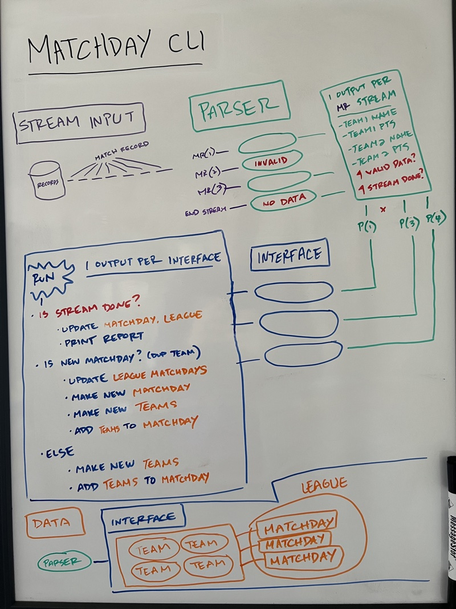

# Design Doc

The goal of this document is to outline the design phase of this application. For an overview of the application, please see the [product specifications](./PROMPT.md).

The CLI application is written in Python and tested using Pytest.

## Table of Contents

* [Primary Components](#primary-components)
  * [Streaming Input](#streaming-input)
  * [Parsing Input](#parsing-input)
  * [Main Interface](#main-interface)
  * [Business Logic and Data Objects](#business-logic-and-data-objects)
  * [Setup File](#setup-file)
* [Whiteboard](#whiteboard)
* [Testing](#testing)

## Primary Components <a name="primary-components"></a>

The primary components of this program include: 

* A mechanism for streaming input either from stdin or from a file supplied to the command
* A parser that formats the incoming stream data for use with the main program interface
* An interface for running the program when a new stream of data comes through
* A series of algorithms that uses dataclasses, collections, and print statements to output matchday results
* A setup file that installs the `matchday` command

### Streaming Input <a name="streaming-input"></a>

The product specifications list two different streams of input: piped to stdin and a file. Python has builtins for handling streaming inputs, and this will be leveraged for both input types. The `sys.stdin.readline()` and the `file.readline()` methods can be put in an infinite loop, and a `break` statement can be added to terminate the program execution when a specific criteria is met. The ideal criteria for this is when the stream inputs `None`.

### Parsing the Input <a name="parsing-input"></a>

The input is formatted as lines of strings representing match records for soccer games. The program must derive the number of teams in a league from the input, and it depends on specific string formatting to determine not just the team names, but their scores. Here is a sample line of input:

```
San Jose Earthquakes 3, Santa Cruz Slugs 3
```

Rather than passing this directly to the interface that manages the business logic of the application, it's best to create a layer that not only formats this input string to something intuitive, but also validates the incoming data.

Note that the structure of the match record follows this pattern:

```
San Jose Earthquakes 3, Santa Cruz Slugs 3
# team name
# score
# comma
# team name
# score
# newline
```

The first thing the input parser should do is validate the match record. A regex will be ideal here. and [Rubular](https://rubular.com/) has a fantastic GUI for building complex regex expressions.

When parsing the input, the expected output should include:
* The two team names
* The two team scores
* The win, loss, or draw count for each team

### Main Interface <a name="main-interface"></a>

Once the incoming data stream is validated and parsed to a machine readable format, it gets input to an interface that executes the program for every new line of data coming in from the stream. This interface has to:

* Initialize the team data input from the parser
* Create data objects to record SoccerTeam, Matchday, and League information for the lifecycle of the tream
* (mvp+) Handle persisting these data objects to a database or saved as output files
* Printing the expected output, a matchday report that shares the matchday number and top 3 teams by score, with tied scores alphabetized by team name

So the sample input line above would be output to stdout as:

```
Matchday 1
San Jose Earthquakes, 1pt
Santa Cruz Slugs, 1pt
```

Each team has 1 point from the tie game, and the teams are ordered alphabetically.

### Business Logic and Data Objects <a name="business-logic-and-data-objects"></a>

The main interface relies on business logic and data objects to maintain state as the stream persists.

The business logic of this program needs to address the following questions:
* What happens when a matchday starts?
* When does a matchday end?
* How many points does a team have?

A matchday can begin in two ways:
1. The initialization of a Matchday() object when a stream starts
2. When a new match record has teams who belong to the current matchday

The first case happens whenever the program begins. The second case is more interesting. The business logic has to be able to find teams in a matchday, and if those teams exist in the current match record as well as the current matchday, this signals to the program that the current record is for a new matchday. At this point, we should print the report, end the current matchday, and initialize a new one.

A team's points increments over time and is determined by these simple rules:
* The winning team earns 3 points
* A tie score earns each team 1 points
* A losing team earns 0 points

The data objects, which will be represented by Python's [dataclasses](https://docs.python.org/3.8/library/dataclasses.html), are used in place of a persistant database or output file. This decision is purely based on project scope, and is intended to be built in such a way that it could scale to use a more permanent record keeping tool (like PostgreSQL or cloud-hosted file storage).

The data objects required by this program include:
* A team, which has a name, a w-d-l record, and a point total from the match
* A matchday, which has many soccer teams, a count, and a way to lookup teams
* A league, which is a collection of matchdays. It would be nice to also know how many teams belong to a league for validation and testing purposes

### Setup File <a name="setup-file"></a>

This is a command-line application, and as such will require a setup file to install dependencies, create the `matchday` command, and link it to the main function which runs the program

## Whiteboard <a name="whiteboard"></a>



## Testing <a name="testing"></a>

A combination of unit and integration tests are necessary to allow the program to grow while maintaining its core functionality. The goal of these tests should not be to achieve 100% test coverage, but should allow the program to go from single-line input, to single-matchday results, to multiple matchday results, following the sample-input and expected-output provided by the original project file. These are included as `mock_data`.
